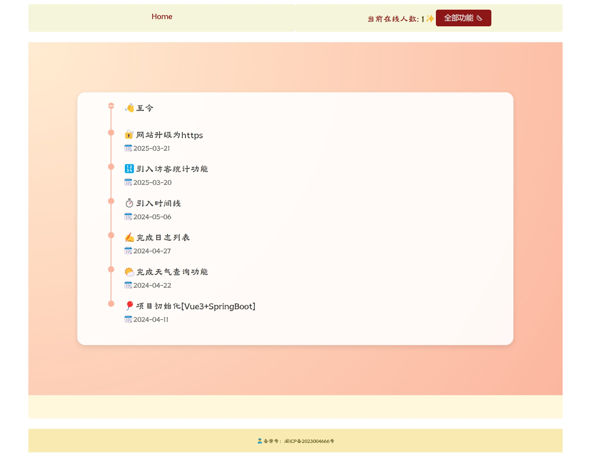
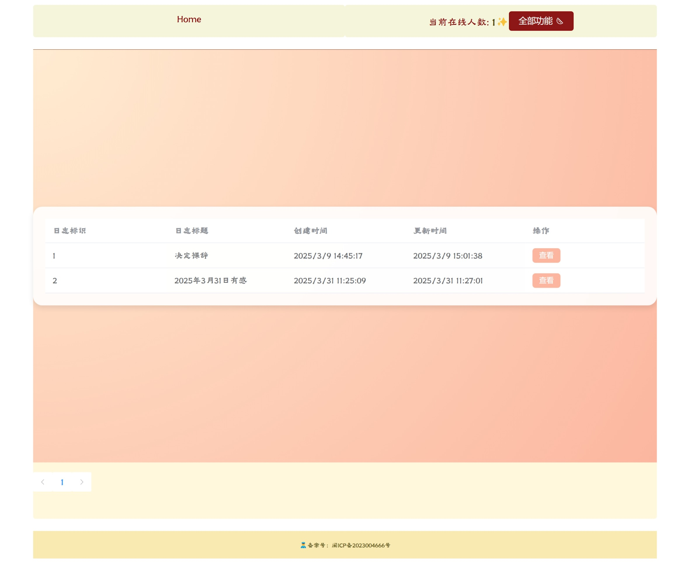
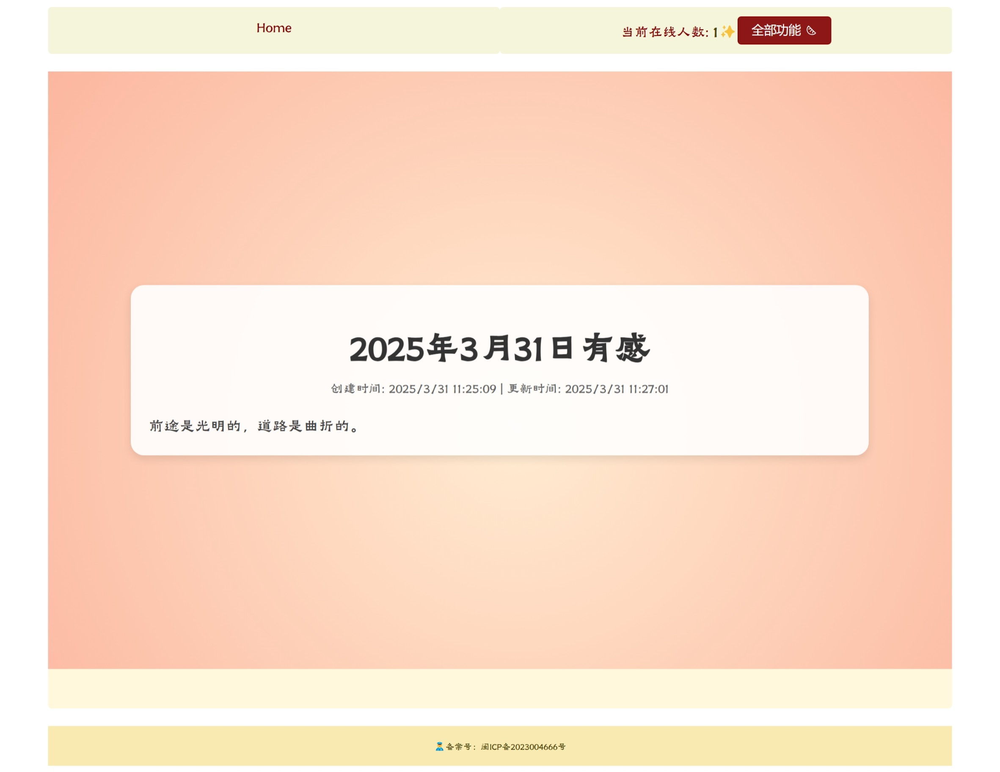
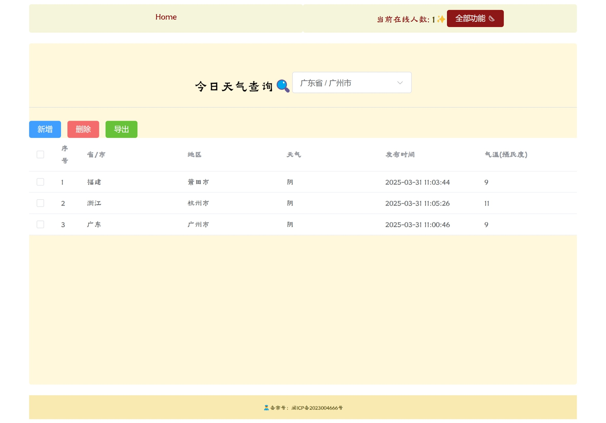
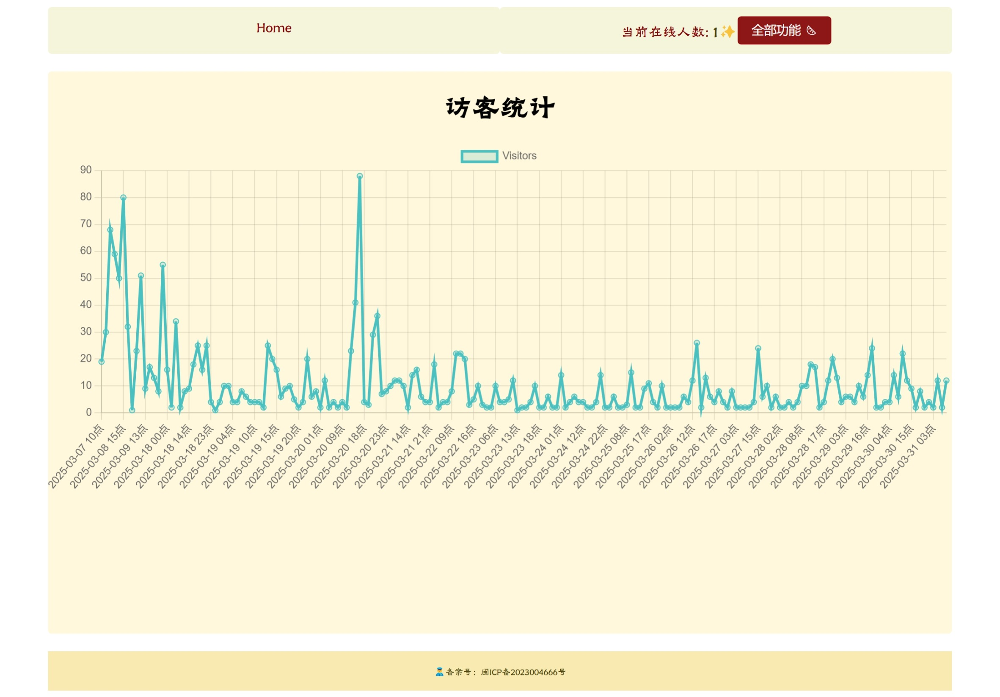
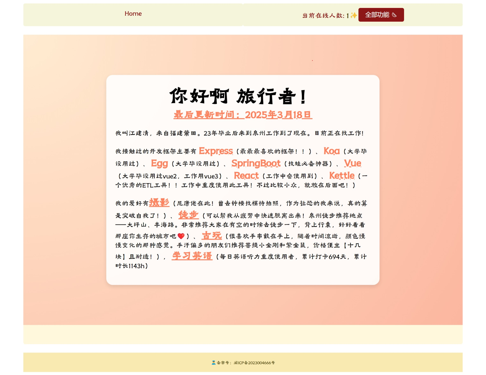

    

<h1 align="center">HOME🏠</h1>

<h2 align="center">
    <a href="https://www.wbeishangw.top/" target="_blank" rel="noopener noreferrer">在线预览</a>
</h2>

## 项目简介
本项目为本人的个人网站，主要模块有**日志模块**、**天气模块**、**在线人数模块**、**访客数据可视化模块**

## 技术栈
### 前端（my-home-client-vue）
Vue 3、Element Plus、Axios、Vue Router、Less、Lodash、ECharts、SockJS、Vite

### 后端（my-home-server-springboot）
Spring Boot、MyBatis-Plus、EasyExcel、MySQL、Lombok、Logback

### 运行效果预览

    

        <h4>主页</h4>
        
    

    

        <h4>博客列表</h4>
        
    

    

        <h4>博客详情</h4>
        
    

    

        <h4>天气信息</h4>
        
    

    

        <h4>访客统计</h4>
        
    

    

        <h4>关于我们</h4>
        
    

## 许可证

本项目采用 [MIT License](https://opensource.org/licenses/MIT) 许可证，详情请查看 [LICENSE](./LICENSE) 文件。