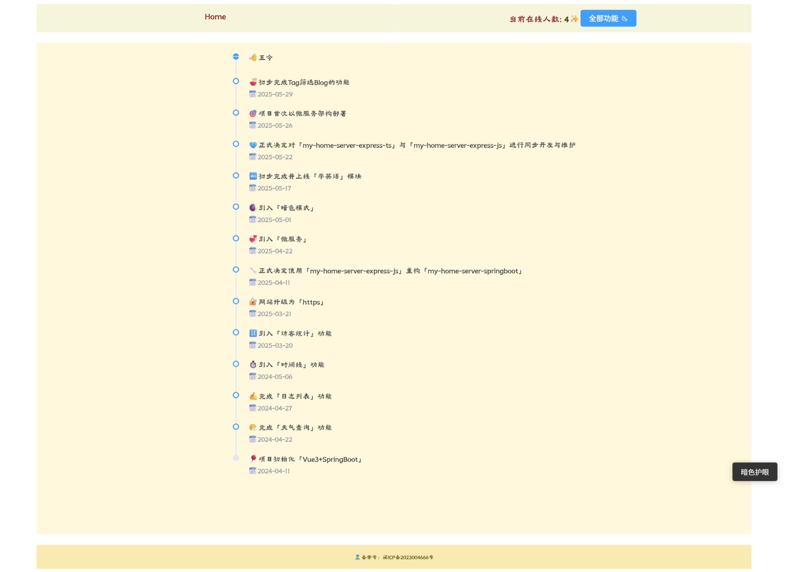
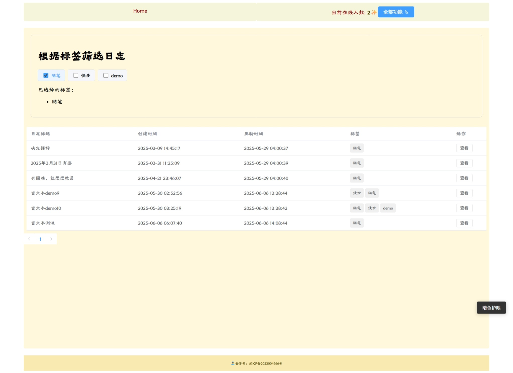
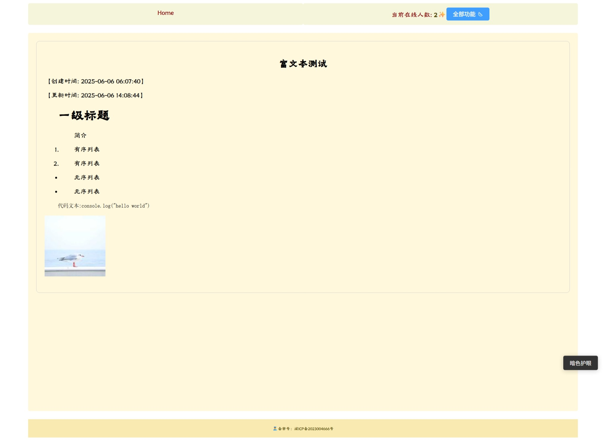
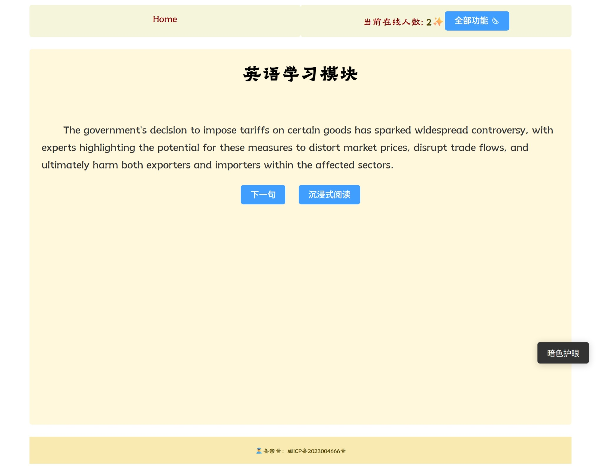
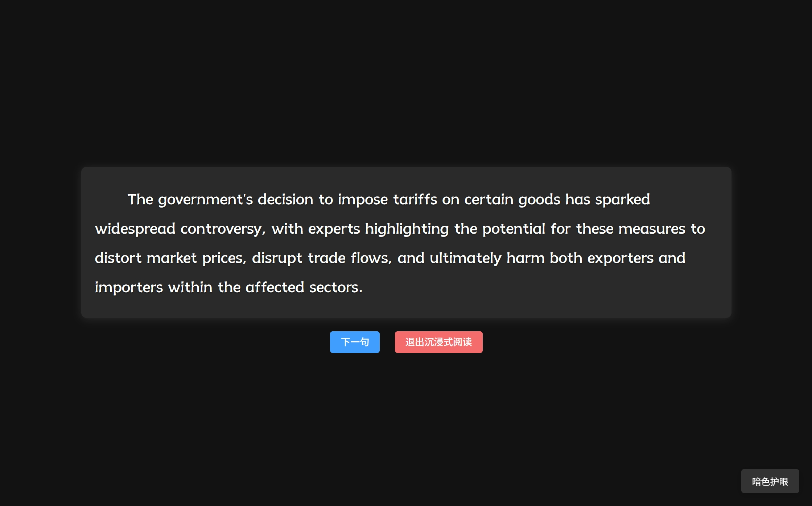
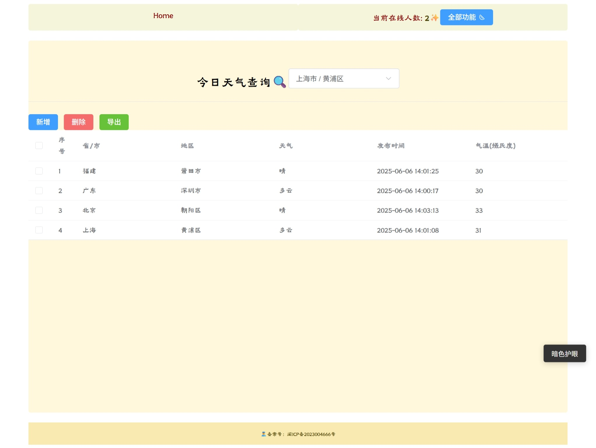
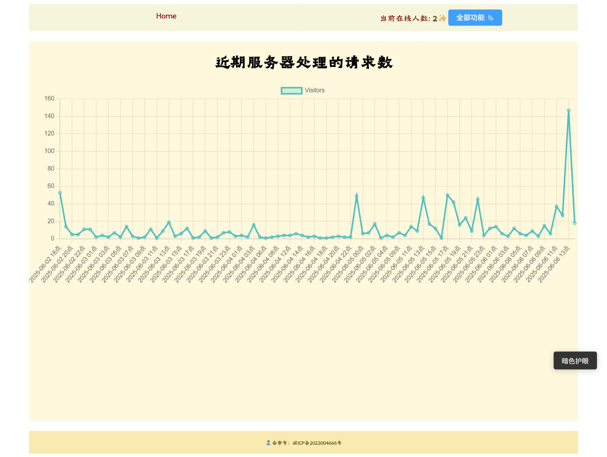
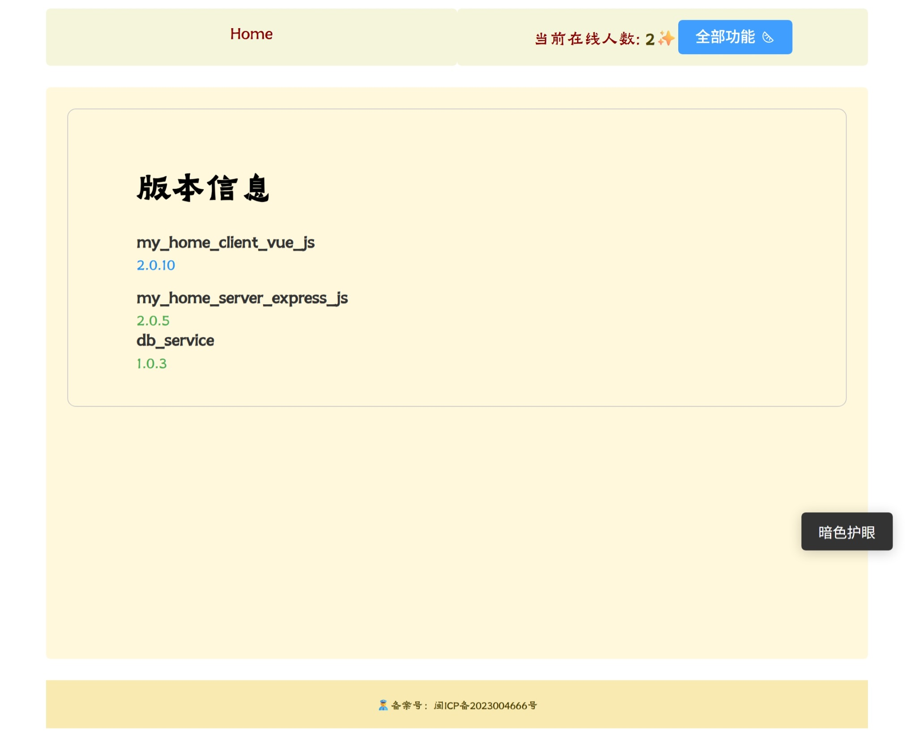
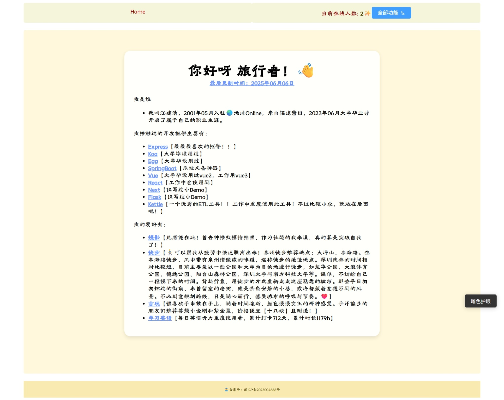

<div align="center">
    
</div>

<h1 align="center">HOME🏠</h1>

<h2 align="center">
    <a href="https://www.wbeishangw.top/" target="_blank" rel="noopener noreferrer">在线预览</a>
</h2>

## 项目简介
本项目为本人的个人网站，主要模块有**日志模块**、**富文本模块**、**标签模块**、**天气模块**、**在线人数模块**、**访客数据可视化模块**、**版本模块**

主要`子项目`介绍：
- `my-home-client-vue-ts`:本站前端
- `my-home-server-express-ts`：本站后端
- `manage-client-react-ts`：管理前端
- `manage-server-express-ts`：管理后端

主要`微服务`介绍：
- `db-service`:数据库微服务

## 运行效果预览

<div align="center">
    <div>
        <h4>过渡页</h4>
        
    </div>
    <div>
        <h4>时间线</h4>
        
    </div>
    <div>
        <h4>博客列表</h4>
        
    </div>
    <div>
        <h4>博客</h4>
        
    </div>
    <div>
        <h4>英语学习</h4>
        
    </div>
    <div>
        <h4>沉浸式英语学习</h4>
        
    </div>
    <div>
        <h4>天气查询</h4>
        
    </div>
    <div>
        <h4>访客统计</h4>
        
    </div>
    <div>
        <h4>版本页</h4>
        
    </div>
    <div>
        <h4>关于</h4>
        
    </div>
</div>


## 技术栈
### 前端【my-home-client-vue-js】
Vue 3、 Element Plus、Chart.js、Axios、WebSocket、Vue Router。

#### 项目结构
```
├── .dockerignore
├── .env
├── .env.sample
├── .nvmrc
├── docker-entrypoint.sh
├── dockerfile
├── generate-structure.js
├── index.html
├── myNginxConf
│   ├── cert
│   │   ├── wbeishangw.top.key
│   │   └── wbeishangw.top.pem
│   └── nginx.conf
├── myNginxHtml
│   ├── assets
│   │   ├── AlimamaDaoLiTi-CFB9AEdD.woff
│   │   ├── AlimamaDaoLiTi-CVyDAlov.woff2
│   │   ├── AlimamaDaoLiTi-CwVsJYFy.ttf
│   │   ├── earth-DlLNqtlX.png
│   │   ├── index-BhQG0CgC.js
│   │   └── index-dzuLfzCx.css
│   ├── home.svg
│   ├── home2.svg
│   ├── index.html
│   └── windy.jpg
├── package.json
├── pnpm-lock.yaml
├── public
│   ├── css
│   │   ├── entranceWebBeautify.css
│   │   └── selectionBeautif.css
│   ├── home.svg
│   ├── js
│   │   ├── clickBeautify.js
│   │   ├── entranceWebBeautify.js
│   │   └── eyeProtection.js
│   └── windy.webp
├── src
│   ├── App.vue
│   ├── assets
│   │   ├── earth.png
│   │   ├── home_.svg
│   │   ├── qrcode.jpg
│   │   └── vue_.svg
│   ├── components
│   │   ├── About
│   │   │   └── index.vue
│   │   ├── AboutWebsite
│   │   │   └── index.vue
│   │   ├── AllFunction
│   │   │   └── index.vue
│   │   ├── Blog
│   │   │   └── index.vue
│   │   ├── BlogDetail
│   │   │   ├── index.vue
│   │   │   └── index_v1.vue
│   │   ├── ChartComponent
│   │   │   └── index.vue
│   │   ├── DataDisplay
│   │   │   └── index.vue
│   │   ├── English
│   │   │   └── index.vue
│   │   ├── EnglishSentenceViewer
│   │   │   └── index.vue
│   │   ├── Err
│   │   │   └── index.vue
│   │   ├── Feedback
│   │   │   └── index.vue
│   │   ├── FixedList
│   │   │   └── index.vue
│   │   ├── Footer
│   │   │   └── index.vue
│   │   ├── Game
│   │   │   └── index.vue
│   │   ├── Layout.vue
│   │   ├── List
│   │   │   └── index.vue
│   │   ├── Login
│   │   │   └── index.vue
│   │   ├── Menu
│   │   │   └── index.vue
│   │   ├── OnlineCount
│   │   │   └── index.vue
│   │   ├── RichTextDisplay
│   │   │   └── index.vue
│   │   ├── TagSelector
│   │   │   └── index.vue
│   │   ├── Timeline
│   │   │   └── index.vue
│   │   ├── Version
│   │   │   └── index.vue
│   │   ├── VisitorStatistics
│   │   │   └── index.vue
│   │   ├── Weather
│   │   │   └── index.vue
│   │   └── World
│   │       └── index.vue
│   ├── font-style
│   │   ├── AlimamaDaoLiTi.ttf
│   │   ├── AlimamaDaoLiTi.woff
│   │   ├── AlimamaDaoLiTi.woff2
│   │   └── font.css
│   ├── lib
│   │   ├── api
│   │   │   ├── blog.js
│   │   │   ├── english.js
│   │   │   ├── http.js
│   │   │   ├── index.js
│   │   │   ├── version.js
│   │   │   ├── visit.js
│   │   │   └── weather.js
│   │   ├── index.js
│   │   ├── utils
│   │   │   ├── device.js
│   │   │   ├── index.js
│   │   │   ├── messageNotify.js
│   │   │   └── startInfo.js
│   │   └── websocket
│   │       ├── index.js
│   │       └── onlineCount.js
│   ├── main.js
│   ├── router
│   │   └── index.js
│   └── views
│       └── ArticleView.vue
└── vite.config.js
```

### 后端【my-home-server-express-js】
Express、Prisma、MySQL、Redis、RabbitMQ、WebSocket、PM2。

#### 项目结构

```
├── .dockerignore
├── .env
├── .env.example
├── .nvmrc
├── app.js
├── code.json
├── config
│   └── index.js
├── config-sample
│   └── index.js
├── controller
│   ├── blogController.js
│   ├── dbserviceVersionController.js
│   ├── englishController.js
│   ├── index.js
│   ├── versionController.js
│   ├── visitController.js
│   └── weatherController.js
├── dockerfile
├── ecosystem.config.js
├── generate-structure.js
├── lib
│   ├── index.js
│   ├── prisma.js
│   └── redis.js
├── markdown
│   └── dockerfile+pm2.md
├── middlewares
│   ├── index.js
│   ├── loggerMiddleware.js
│   └── recordVisitorsMiddleware.js
├── package.json
├── pnpm-lock.yaml
├── prisma
│   └── schema.prisma
├── PROJECT-STRUCTURE.md
├── public
│   └── favicon.ico
├── README.md
├── resource
│   └── weather
│       └── AMap_adcode_citycode.xlsx
├── routes
│   ├── blog.js
│   ├── dbserviceVersion.js
│   ├── english.js
│   ├── index.js
│   ├── version.js
│   ├── visit.js
│   ├── weather.js
│   └── ws.js
├── rpc
│   └── rabbitmq
│       └── index.js
├── service
│   ├── blogService.js
│   ├── englishService.js
│   ├── index.js
│   ├── onlineCount
│   │   ├── index.js
│   │   ├── ws.js
│   │   └── wsAndRedis.js
│   ├── rpc
│   │   ├── blogService.js
│   │   ├── dbserviceVersionService.js
│   │   ├── englishService.js
│   │   └── visitService.js
│   ├── version
│   │   ├── getVersion.js
│   │   └── index.js
│   ├── visitService.js
│   └── weatherService.js
└── utils
    ├── index.js
    ├── R.js
    ├── test.js
    └── xlsx.js
```

### 数据库服务【db-service】
Express、Prisma、PM2、RabbitMQ。

#### 项目结构

```
├── .dockerignore
├── .env
├── .env.example
├── .nvmrc
├── app.js
├── config
│   └── index.js
├── config-sample
│   └── index.js
├── constants
│   └── index.js
├── controller
│   ├── manage-server-express-js
│   │   ├── blog.js
│   │   ├── dbServiceVersion.js
│   │   ├── english.js
│   │   ├── index.js
│   │   └── visit.js
│   └── my-home-server-express-js
│       └── index.js
├── dockerfile
├── ecosystem.config.js
├── generate-structure.js
├── lib
│   ├── generated
│   │   └── prisma
│   │       ├── client.d.ts
│   │       ├── client.js
│   │       ├── default.d.ts
│   │       ├── default.js
│   │       ├── edge.d.ts
│   │       ├── edge.js
│   │       ├── index-browser.js
│   │       ├── index.d.ts
│   │       ├── index.js
│   │       ├── package.json
│   │       ├── query_engine-windows.dll.node
│   │       ├── runtime
│   │       ├── schema.prisma
│   │       ├── wasm.d.ts
│   │       └── wasm.js
│   ├── prisma.js
│   └── rabbitmq
│       └── index.js
├── middleware
│   └── index.js
├── package.json
├── pnpm-lock.yaml
├── prisma
│   └── schema.prisma
├── PROJECT-STRUCTURE.md
├── R.js
├── README.md
├── router
│   ├── manage-server-express-js
│   │   ├── index.js
│   │   └── routerConfig
│   │       ├── blog.js
│   │       ├── dbserviceVersion.js
│   │       ├── english.js
│   │       ├── index.js
│   │       └── visit.js
│   └── my-home-server-express-js
│       └── index.js
├── scheduledTasks
│   └── index.js
├── service
│   ├── blogService.js
│   ├── dbserviceVersionService.js
│   ├── englishService.js
│   ├── index.js
│   └── visitService.js
├── task
│   └── index.js
└── utils
    └── index.js
```

## 许可证

本项目采用 [MIT License](https://opensource.org/licenses/MIT) 许可证，详情请查看 [LICENSE](./LICENSE) 文件。